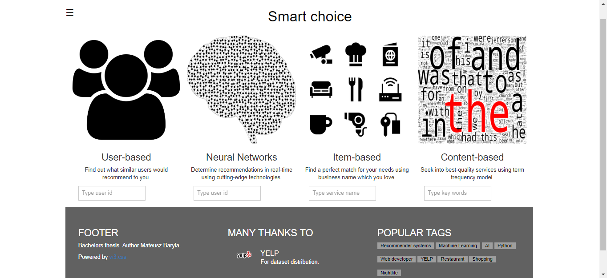
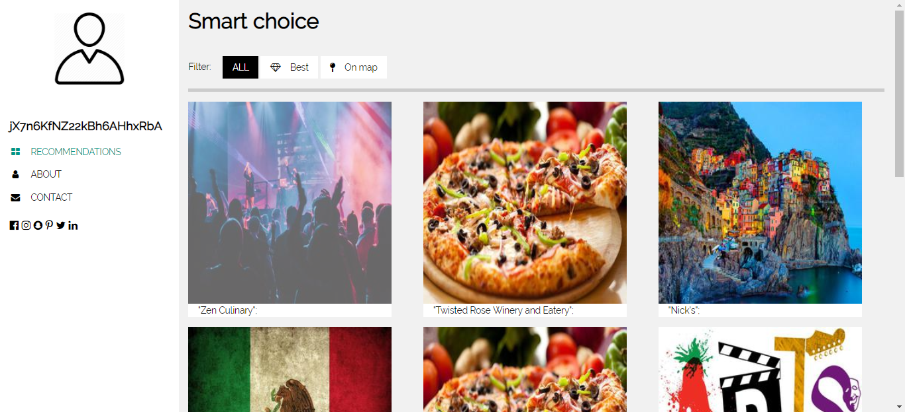
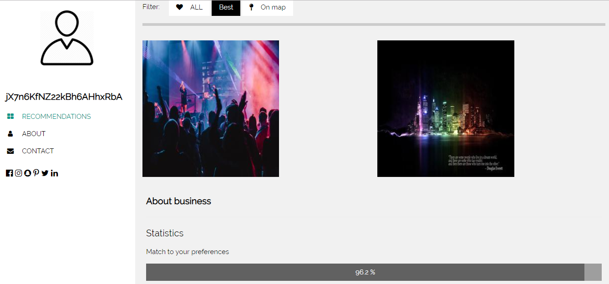
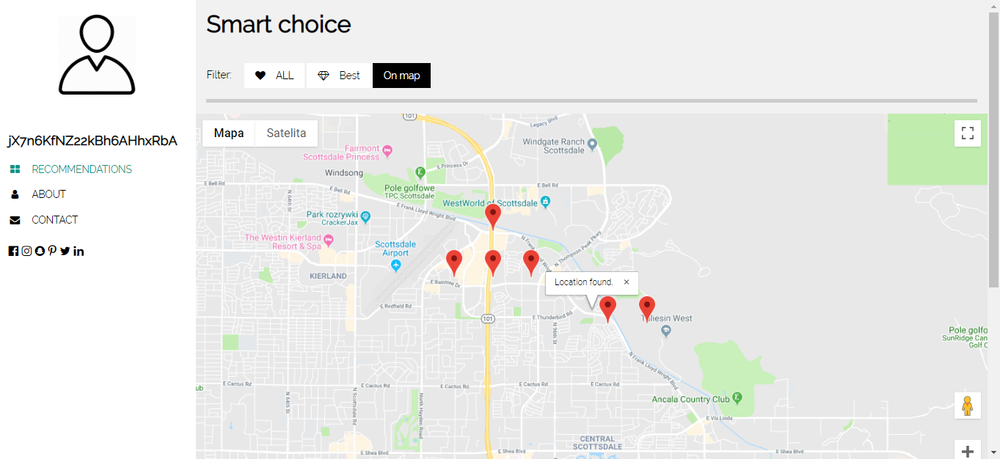

Recommender systems play an important role in many web services. Thanks to them Internet platforms can generate maximum profit and their clients be as satisfied as possible. In my thesis I focused on comparison of algorithms and then I implemented the best one in form of a web application. Neural networks are used as well due to their increasing popularity in recommendation tasks.

On index page app user has 4 main choices of recommendations:
- collaborative filtering where was used baseline model
- neural networks model with one hidden layer
- knn based algorithm
- content based algorithm

When user sends request to a server by filling a form he or she is redirected to the new page with the best recommendations.

Best tab shows level of similarity between a user and an item.

All recomendations are shown to a user based on his or her location (if the user hasn't changed the original one).

App was designed in a web app architecture where all the data is stored on a server.

*source: https://www.scnsoft.com/blog/web-application-architecture* 

Below you can find a video of the application.

<iframe width="560" height="315" src="https://www.youtube.com/embed/tKwbLZ40nag" title="YouTube video player" frameborder="0" allow="accelerometer; autoplay; clipboard-write; encrypted-media; gyroscope; picture-in-picture" allowfullscreen></iframe>