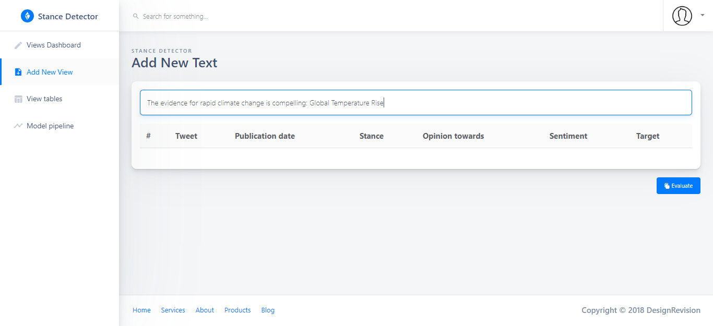
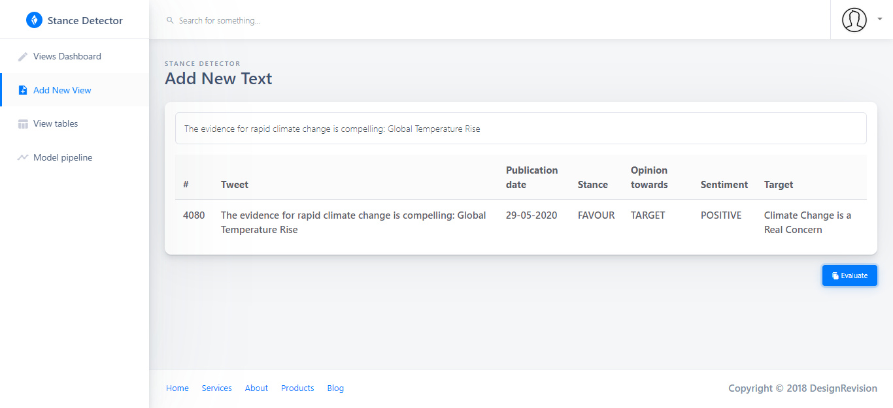
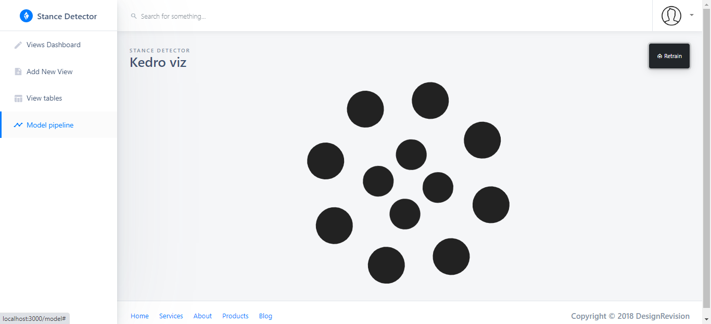
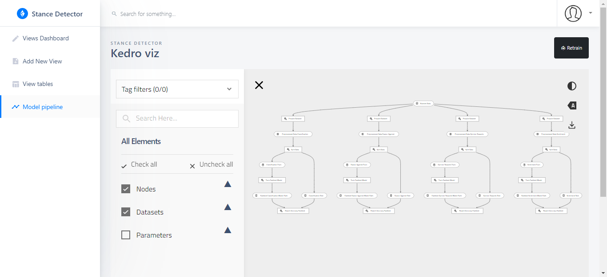
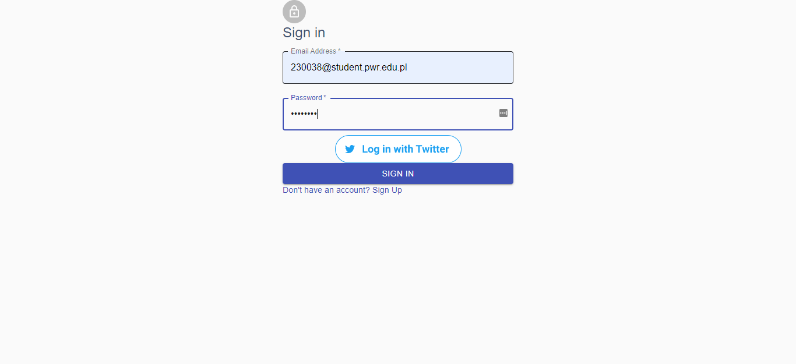
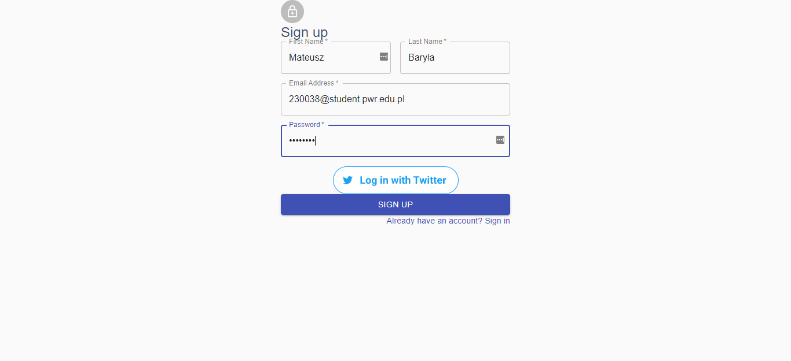
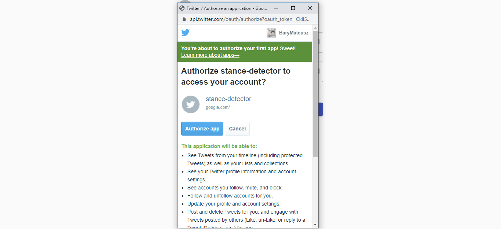
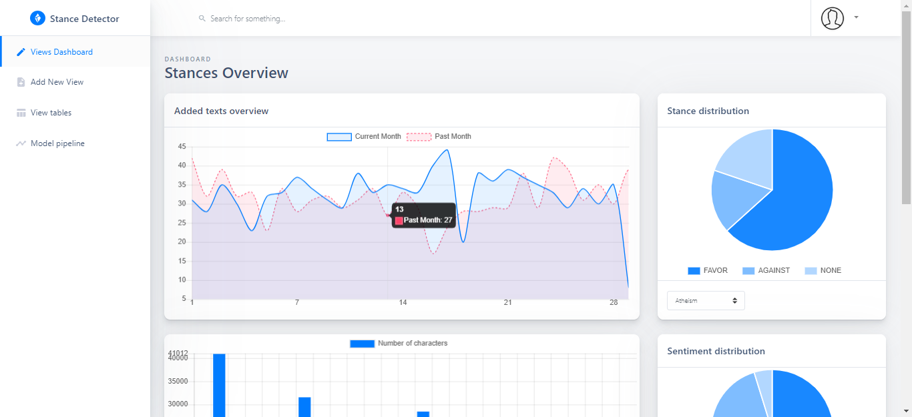

Natural language processing and opinion mining plays important role in business
analysis because of the data that is currently accessible in the Internet. Sentiment
analysis is applied in every digitalized organization due to the fact of financial
benefits that can came out of it. In my second bachelor's thesis I focused 
on stance detection, and implementing this service in a form of web application.

During the SemEval challenge in 2016 stance detection was popularized. The dataset provided there was used as a main data source to train machine learning models. The modern libraries such as Kedro or FastText were used in the app.

Kedro is an open-source library, developed by QuantumBlack in 2019. This company was acquired by McKinsey. This library creates portable data pipelines that are reproducible, modular, and well-documented.

Kedro architecture distinguishes three building blocks:
- project
- pipeline
- nodes

First of it is the project which contains key elements of each and single Kedro Project.

All the datasets can be accessed in our project as soon as they are included in the configuration file which can be described as a registry of the datasets in use. The main idea of Kedro is to orchestrate the DE (data engineering) and DS (data science) pipeline into single application. Pipeline consists of nodes. Every node can have input and output dataset. Inside node transformation are performed. 

In the app that I describe in this post kedro pipeline was used to retrain the model once new data flow. 
Single observation is evaluated from the app by several ML models. 

After a user clicks evaluate the text is being evaluated by stance detector and result
are visible for the added text. User can see Tweet, Publication date, Stance, Opinion
towards, Sentiment and Target.

The retrain button is used for model fine-tuning once new stances are added to the dataset. 

What is very convenient as well is the pipeline abstraction due to Kedro-Viz pipeline.

Data science part of this application I already described - providing a machine-learning solution for a problem of stance detection. 
The other requirement of this bachelor thesis was to  build a modern web application with
rendered front-end as well as defining REST Api for other contributors to this project.

A user has to sign up in on a website with his or her first name, last name, e-mail,
and password. Password is required to have at least eight characters, small/big letters (up
to two big letters) at least one number at least one special character.

After a successful sign-up user is redirected to the sign-in page. Then a user needs to
fill the form with e-mail and password.

The user can also use Twitter OAuth Log in as well. Then he is redirected to the
Twitter OAuth where a user needs to authorize stance detector application to access an
account.

Then a user is redirected to the web application initial page, dashboard. In the
dashboard, the user can see a few graphs and investigate stance distribution in the system.
There is a plot that shows text distributed in time in the current and in the previous
month. After hover, there is information about the exact value and day of the month as
well. A pie chart shows a stance distribution for different labels.

After scrolling-down, a user can see histograms of most commonly used letters and
words in the Text table. He or she can also check opinion distribution and sentiment
distribution thanks to pie charts.